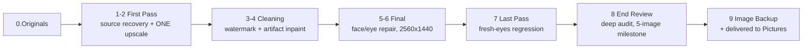

# Legion Wallpaper

A staged, self-auditing **image restoration pipeline**, and the agent operating
system that builds it.

Drop an illustration into `images\0.Originals` and the pipeline recovers the
best full-res source, upscales it exactly once, removes watermarks and
generation artifacts by masked inpainting, repairs illustrated faces and eyes,
audits its own output at every stage through a metric plus vision gate ladder,
and delivers an approved 2560x1440 PNG. Autonomy is earned through a
calibration ladder (shadow -> spot-check -> full auto), never assumed: an
unproven stage runs in shadow mode and every promotion is backed by a measured
census, not a hunch.

It restores a personal corpus of roughly 300 League-splash-style wallpapers on
one Windows workstation (the "Legion machine"). **The images are not here and
never will be.** They are third-party illustrations; `images/**` is gitignored
and the restored output stays private. What this repo publishes is the
PROCESS: the pipeline code, the gate ladder, the golden-set regression
protocol, the provenance manifests, and the multi-agent operating system that
produced all of it.

## The pipeline

Ten numbered stage folders under `images\`, each a scratch/done pair, with an
append-only transition log and an atomic state file. Every stage advance is
gated: G0 intake sanity, G1 full-reference fidelity metrics at a common scale,
G2 style checks, on up through a Claude vision review that may FLAG but never
REJECT (ADR-008). A gate rejection demotes the image to the previous stage with
the reason logged, or routes it to a human QA queue. Nothing advances on an
unbacked claim.

Design decisions live as numbered ADRs in `docs/adr/`: the product and
architecture (ADR-002), the folder and state scheme (ADR-003), the primary
upscaler chosen on a golden A/B sweep (ADR-004), signature removal (ADR-005),
the downscale-only gate (ADR-006), the comparison pixel budget (ADR-007), the
vision-reviewer authority limit (ADR-008), and one cleaning engine per
submission (ADR-009). The operational plan is `docs/RESTORATION_PLAN.md`.

## What is reusable here

You cannot run this pipeline end to end without the corpus, but the machinery
around it is general and is the reason the repo is public:

| Piece | Where | What it does |
|---|---|---|
| Agent operating contract | `CLAUDE.md` | Rules, tiers, gates, and rituals an AI agent must follow to work in this repo |
| Multi-agent framework | `docs/AGENTS.md`, `.claude/` | Orchestrator plus worktree subagent slices plus a read-only verifier that must CONFIRM before any merge |
| Verifier subagent | `.claude/agents/verifier.md` | Independently re-runs the suite and falsifies an implementing agent's "green" claim |
| Commit and hygiene gates | `tools/precommit_gate.py`, `tools/install_git_hooks.py` | Blocks banned glyphs and net-new lint on staged lines; `--check` proves the hooks actually fire |
| Drift guard | `tools/drift_guard.py` | Session-start probe that catches silently dead hooks, stale config, and doc drift |
| Headless run loop | `ops/loop/` | Self-continuing `claude -p` executor with slot arbitration and a truth gate |
| Pipeline state machine | `tools/lw_pipeline.py` | Atomic stage transitions, per-image manifests, append-only transition log |

The recurring theme: **an agent's claim is not evidence.** Most of the code
above exists to make a machine prove its own work before a human is asked to
believe it.

## Status and scope

Active personal project, built in the open. It is shaped entirely around one
machine, one corpus, and one operator, so it is a reference to read and borrow
from rather than a product to install. Issues and pull requests are not being
solicited, and the roadmap is driven by `ROADMAP.md` alone. Requirements are
Windows plus Python 3.14, with GPU-backed upscaling and inpainting venvs that
are provisioned outside the repo.

## Where things live

| Surface | Path |
|---|---|
| Operational plan (the pipeline, gates, autonomy ladder) | `docs/RESTORATION_PLAN.md` |
| Architecture and module map | `docs/ARCHITECTURE.md` |
| Ops commands and runbook | `docs/OPERATIONS.md` |
| Pipeline stage folders (gitignored content) | `images\0.Originals` .. `images\9.Image Backup` |
| Pipeline machine state (atomic) | `ops/runtime/pipeline_state.json` |
| Pipeline transition log (append-only, gitignored) | `PIPELINE_LOG.md` |
| Operating rules (per-session auto-load) | `CLAUDE.md` |
| Harness config, hooks, agents, commands | `.claude/` |
| Roadmap (highest priority at TOP) | `ROADMAP.md` |
| Aspirational backlog | `BACKLOG.md` |
| Session hand-off notes (newest-first) | `WAKEUP_NOTES.md` |
| Per-item completion ledger (append-only, newest-first) | `docs/LEDGER.md` |
| Decisions | `docs/adr/` |
| Runtime health (once the product runs) | `ops/runtime/health.json` |
| Daily logs | `logs/YYYY-MM-DD.log` |

## How this repo operates

The operating system here was inherited 1:1 from a prior project (ADR-001) and
is enforced by hooks, not by good intentions.

- **TDD, RED-first.** Every feature or bugfix starts with a failing test. No
  implementation before the test is observed RED.
- **Tiered verification.** Changes are classified by tier; each tier carries a
  mandatory verification gate (docs-only through full-suite plus restart plus
  health confirm). Never claim success without running the gate.
- **Subagent-first delegation.** Non-trivial work fans out to worktree subagent
  slices; an independent read-only verifier must CONFIRM before the orchestrator
  merges. The orchestrator is the sole merger.
- **Session rituals.** Wake up by reading `WAKEUP_NOTES.md` plus `ROADMAP.md`;
  wrap up by appending a ledger entry to `docs/LEDGER.md`, updating
  `WAKEUP_NOTES.md` (newest-first, archive older sessions to
  `docs/history_notes.md`), and syncing the roadmap.
- **Ledger discipline.** Every completed item gets a numbered, append-only,
  newest-first entry in `docs/LEDGER.md`. Never append ledger entries to
  `CLAUDE.md` (it has a hard size budget).
- **Decisions are ADRs.** Anything with lasting consequences gets a numbered
  file in `docs/adr/` (see `docs/adr/TEMPLATE.md`). ADR-001 records this
  inheritance itself.
- **Style hard rule.** 7-bit ASCII only in authored content: no em or en
  dashes, no smart quotes.

Full rules: `CLAUDE.md`.

## License

Apache License 2.0, see `LICENSE`. The license covers the PROCESS shipped in
this repo (pipeline code, gate ladder, docs, agent framework). It does not and
cannot grant any right to the image corpus: the wallpapers are third-party
illustrations, they are never tracked here (`images/**` is gitignored), and the
restoration output stays private per `docs/RESTORATION_PLAN.md` section 10.
